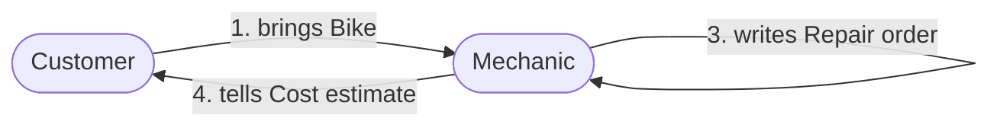

# Domain story format

Text form of a domain story. It keeps stories saveable, diffable and readable
by other agents, and converts mechanically to a picture.

## Building blocks

- **Actor**: a person, a group, or a software system. Noun, from the domain
  language. Appears once per story.
- **Work object**: a document, physical thing, digital object, or piece of
  information the actors create, use or exchange. Noun. Draw a separate work
  object for every activity, even if the same thing appeared earlier; it may
  change status or medium (a ticket on paper vs. by email).
- **Activity**: what an actor does. Verb, active voice, from the domain
  language. Starts at the actor that initiates it.
- **Sequence number**: orders the sentences into a story.
- **Annotation**: text for variations, optional steps, possible errors,
  assumptions, term explanations.
- **Group**: clusters parts of a story: repeated or optional stretches,
  locations, organizational boundaries, subdomains.

Every sentence answers: who (actor) does what (activity) with what (work
object) with or for whom (other actor).

## Sentence syntax

```
<n>. <Actor> <verb> <work object> [to|for|from|with <Actor>]
```

Variations:

```
3. Mechanic inspects Bike                       # actor - activity - work object
4. Mechanic writes Repair order                 # creates a work object
5. Mechanic asks Customer about Defects         # information exchanged between actors
6. Customer approves Cost estimate              # actor - activity - work object
```

Keep it to subject, predicate, object. If a sentence needs "and", it is two
sentences. If it needs "if", move that to an annotation.

## Story file template

```markdown
# <Story name> (<coarse|fine>, <as-is|to-be>, <pure|digitalized>)

Goal of this story: ...
Assumptions: ...   # what keeps this on one track
Storyteller(s): ...

## Sentences
1. [stated] Customer brings Bike to Mechanic
2. [stated] Mechanic inspects Bike
   note: [stated] "inspect" means checking brakes, tires, chain, per the checklist
3. [stated] Mechanic writes Repair order
4. [proposed] Mechanic tells Customer the Cost estimate   ? confirm: before or after inspection?

## Groups
- (optional) steps 5-7: repeated per defect

## Annotations / variations
- [stated] If Customer declines the estimate, the bike is returned as-is (own story? -> user decides)

## Terms
| Term | Meaning | Note |
|---|---|---|

## Open questions
- Q1 ...
```

## Rendering to a diagram

Render on request, mechanically, without adding content.

Rules:
- Each actor becomes one node. Give people and systems different shapes.
- Each sentence becomes one arrow from the initiating actor to the receiving
  actor (or to itself for solo work), labeled `<n>. <verb> <work object>`.
- Actors that only work on an object with nobody else involved: use a
  self-arrow.
- Annotations become notes attached to the relevant arrow's label or a
  comment line.
- Do not add decision diamonds or branches.

Example:

````markdown

````

Mermaid is a review aid. The ordered sentences are the source of truth.

## Worked example (pure, as-is, coarse story)

```
Title: Repairing a flat tire (fine, as-is, pure)
Assumption: the shop has the right inner tube in stock.

1. Customer brings Bike to Mechanic
2. Mechanic inspects Tire
3. Mechanic tells Customer the Cost estimate
4. Customer approves Cost estimate
5. Mechanic replaces Inner tube
6. Mechanic writes Invoice
7. Customer pays Invoice at the counter
   note: cash or card; no discount handling in this story
```

Notice what is absent: no "if stock is missing", no "system updates". Those
belong in a separate story or a digitalized to-be version.

## Glossary template

```markdown
| Term | Meaning | Appears in stories | Said by | Conflict or note |
|---|---|---|---|---|
| Repair order | The written record of what will be done | Repair (3) | Mechanic | Sales calls this "job" |
```

A term with different meanings across stories or roles is a candidate
language boundary; list it in the session summary rather than choosing a
meaning for the user.

## Good language style

- Verbs in active voice, from the user's vocabulary ("writes", "picks",
  "hands over"), not generic ("processes", "handles", "manages").
- Nouns for actors and objects; avoid "the system does everything" arrows in
  pure stories.
- Use roles (Mechanic), not names (Sam), unless the user is telling a
  concrete example on purpose.
- Prefer several short sentences to one long one.
- When the user describes "the usual case", ask for one concrete instance
  and record that; abstract statements hide the details.
