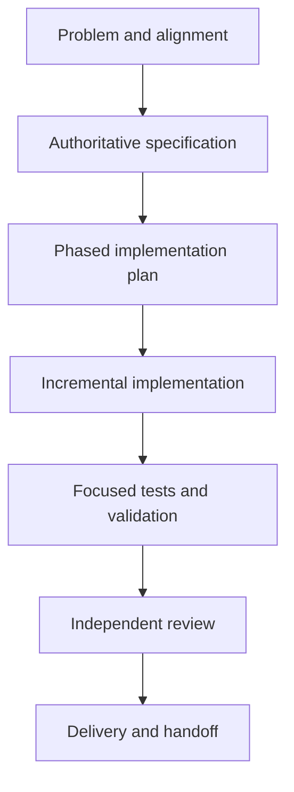

# Spec-Driven Development Protocol

Use this skill when a change crosses multiple modules, affects a user-facing contract, introduces persistent data, or needs coordinated work by more than one contributor or agent. The specification is the shared contract for intent, behavior, interfaces, and verification.

## Core Flow

## Specification Contents

Every non-trivial specification should contain:

### 1. Metadata and Scope

- Feature name and status
- Owner or responsible team
- Related issue or request
- One-paragraph scope statement
- Explicit out-of-scope items

### 2. User and System Outcome

- User problem and intended outcome
- Primary workflows
- Success metrics or acceptance criteria
- Important assumptions and constraints

### 3. Behavior and Domain Rules

- Inputs, outputs, states, and transitions
- Validation, defaults, limits, and error behavior
- Calculations or decision tables, using precise notation where useful
- Idempotency, ordering, retry, and consistency requirements

### 4. Data and Interfaces

- Data models and ownership
- Configuration and runtime state
- API, event, command, or message contracts
- Compatibility, versioning, and migration rules
- Authorization and validation requirements

### 5. Architecture and Responsibilities

- Components or modules to create or change
- Responsibility boundaries
- Dependency direction
- Synchronous versus asynchronous work
- Resource, performance, and observability considerations

### 6. User Experience

- Relevant screens, states, and interactions
- Loading, empty, success, and failure states
- Accessibility, responsive behavior, localization, and reduced motion
- Analytics or operational feedback, when applicable

### 7. Risks and Failure Handling

- Failure modes and recovery behavior
- Security and privacy considerations
- Concurrency and data-loss risks
- Rollback or migration strategy
- Known limitations

### 8. Verification Plan

- Unit, integration, end-to-end, and manual checks
- Test data and deterministic setup
- Acceptance criteria mapped to checks
- Performance, accessibility, and compatibility checks

## Phased Implementation Planning

Break the work into small, independently verifiable phases. Each phase should specify:

- Exact files, modules, or components affected
- Concrete behavior or interfaces delivered
- Dependencies on earlier phases
- Tests or checks to run
- A clear completion condition

A useful default order is:

1. Domain model, configuration, and shared types
2. Core logic and persistence or external boundaries
3. API, event, or integration contracts
4. User-facing presentation and interaction
5. Regression tests, documentation, and full validation

Reorder phases when the architecture or risk profile requires it. Do not split work merely by file; split it by a coherent behavior that can be tested.

## Delegating Work

A bounded implementation task should include:

1. The relevant specification excerpt
2. Exact target files or ownership boundaries
3. Existing interfaces that must remain compatible
4. Invariants and security constraints
5. Expected tests and observable completion criteria
6. Explicit exclusions to prevent scope drift

Avoid delegating vague tasks such as "implement the feature." Give the implementer enough context to make local decisions without redefining the product contract.

## Quality Gate

Before implementation proceeds, confirm:

- The problem and scope are unambiguous.
- The main behavior and error cases are specified.
- Interfaces and ownership boundaries are identified.
- Compatibility and migration concerns are addressed.
- Every acceptance criterion has a verification path.
- The plan is phased into reviewable, reversible units.

Update the specification when a design decision changes. Do not let the code and specification silently diverge.
